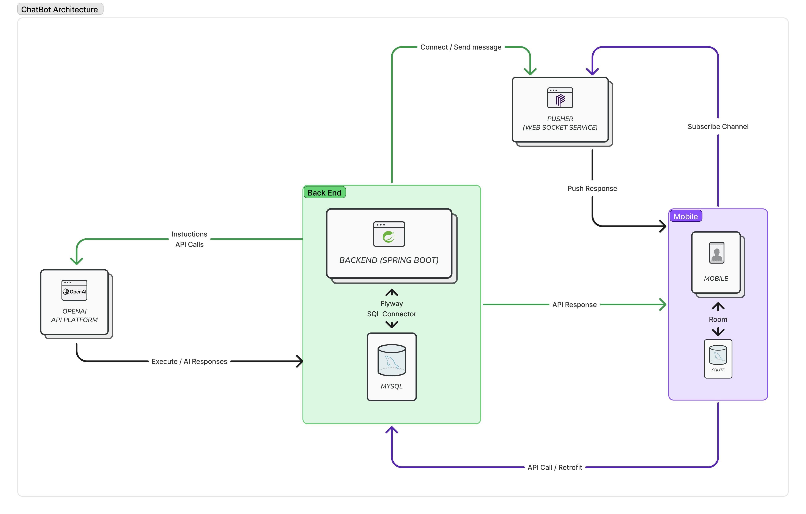

# 🤖 Virtual Assistant Backend

AI-based virtual assistant backend developed in **Spring Boot**, enabling conversational interactions with users through natural language understanding and OpenAI integration.

Created as part of the thesis:  
**"Zhvillimi i një asistenti virtual bazuar në AI për pajisje mobile"**  
by *Endri Binaku* under mentorship of *Prof. Blerim Rexha*  
📄 [Zenodo DOI: 10.5281/zenodo.15193102](https://doi.org/10.5281/zenodo.15193102)

---

## 🚀 Features

- 🧠 Natural Language Processing using OpenAI API (e.g., GPT models)
- 🔌 RESTful API to receive and process user queries
- 🧱 Modular Spring Boot architecture (Controller, Service, DAO)
- 🗣️ Task execution based on intent detection (weather, reminders, etc.)
- 🗃️ Lightweight in-memory storage / embedded DB support
- 📱 Ready to integrate with mobile apps (Android/iOS)

---

## 🏗️ Architecture



### Core Components

- `controller/` – Handles incoming REST requests
- `service/` – Processes inputs and handles AI logic
- `dao/` – Optional data persistence layer
- `model/` – DTOs for requests and responses
- `client/` – Communicates with external APIs (e.g., OpenAI)

---

## 🔧 Getting Started

### Prerequisites

- Java 17+
- Gradle
- OpenAI API Key ([get one here](https://platform.openai.com/account/api-keys))
- Pusher KEY

### Installation

1. **Clone the repository**

   ```bash
   git clone https://github.com/BinakuEndri/virtual-assistant-backend.git
   cd virtual-assistant-backend
   ```

2. **Configure application properties**

   In `src/main/resources/application.properties`, fill in the following:

   ```properties
   server.address=
   server.port=

   spring.datasource.url=
   spring.datasource.username=
   spring.datasource.password=

   spring.flyway.url=
   spring.flyway.user=
   spring.flyway.password=

   application.security.jwt.secret-key=
   application.security.jwt.access-token-expiration=
   application.security.jwt.refresh-token-expiration=
   ```

3. **Create `.env` file**

   At the root of the project, create a file named `.env` and fill in:

   ```env
   OPENAI_API_KEY=sk-proj-.....
   PUSHER_APP_ID=...
   PUSHER_KEY=...
   PUSHER_SECRET=...
   ```

4. **Run the app**

   ```bash
   ./gradlew bootRun
   ```

---

## 📚 Thesis & Documentation

The full thesis and research paper are published here:

📄 [Zenodo Repository – DOI: 10.5281/zenodo.15193102](https://doi.org/10.5281/zenodo.15193102)

---

## 🧑‍💻 Author

**Endri Binaku**  
GitHub: [@BinakuEndri](https://github.com/BinakuEndri)  
Email: binakuendri@gmail.com

### 🎓 Supervisor

**Prof. Dr. Blerim Rexha** – University of Prishtina  
Department of Computer Engineering

---

## 🌐 Acknowledgements

- University of Prishtina – Faculty of Electrical and Computer Engineering  
- OpenAI for enabling natural language APIs  
- All contributors to open-source Spring Boot libraries
